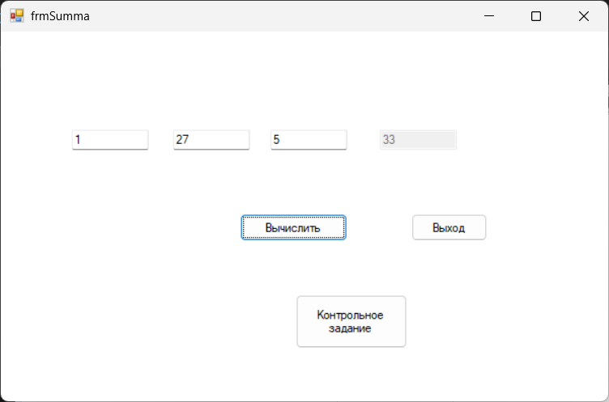
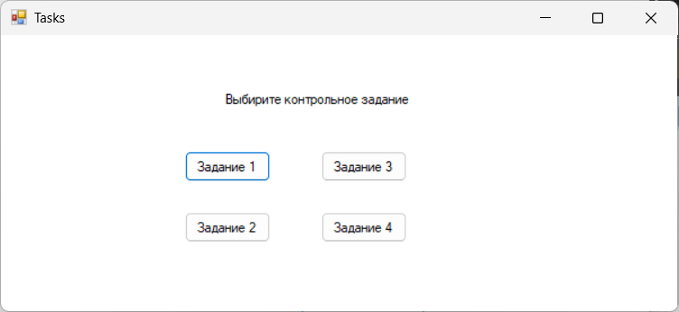
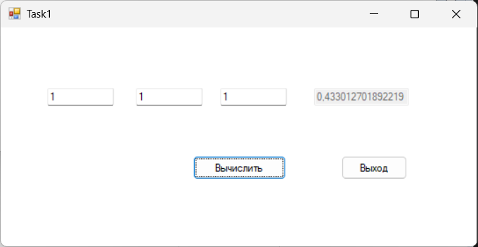
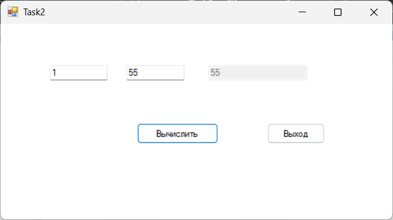
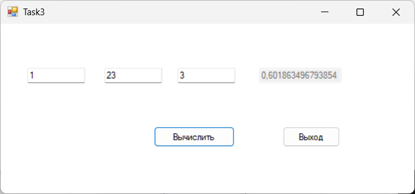
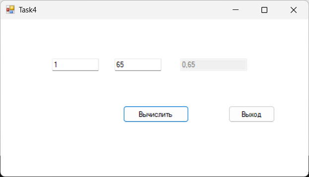

# Лабораторная работа 1

## Элемент управления TextBox (текстовое поле)

### Описание задания:
Выполнить: Разработайте приложение, которое вычисляет сумму
трех любых чисел при нажатии на кнопку.
### Цель
Целью работы является знакомство с элементами управления visual
c# textbox и button — текстовое поле и кнопка.

---
### Интерфейс главной формы (frmSumma.cs)

Название проекта: `Lab1`, название файла формы `frmSumma.cs`

---

### Инструментарий

| Объект              | Свойство `Name` | Свойство `Text`    |
|---------------------|-----------------|--------------------|
| **Форма**           | `frmSumma`      | frmSumma           |
| **Кнопка**          | `btnCount`      | Вычислить          |
| **Кнопка**          | `btnExit`       | Выход              |
| **Кнопка**          | `tasksBtn`      | Контрольное задание|
| **Текстовое поле**  | `txtA`          | 1                  |
| **Текстовое поле**  | `txtB`          | 27                 |
| **Текстовое поле**  | `txtC`          | 5                  |
| **Текстовое поле**  | `txtSumma`      | 33                 |

---

### Контрольное задание (Tasks.cs)

название файла формы `Tasks.cs`

---

### Инструментарий
| Объект              | Свойство `Name` | Свойство `Text` |
|---------------------|-----------------|-----------------|
| **Форма**           | `Tasks`         | Tasks           |
| **Кнопка**          | `task1`         | Задание 1       |
| **Кнопка**          | `task2`         | Задание 2       |
| **Кнопка**          | `task3`         | Задание 3       |
| **Кнопка**          | `task4`         | Задание 4       |
---

---
## Первое задание (Task1.cs)

### Описание задания:
Найти площадь треугольника по трем сторонам

---

### Интерфейс формы первого задания (Task1.cs)

название файла формы `Task1.cs`

---

### Инструментарий

| Объект              | Свойство `Name`        | Свойство `Text`   |
|---------------------|------------------------|-------------------|
| **Форма**           | `Task1`                | Task1             |
| **Кнопка**          | `btnCalculateTriangle` | Вычислить         |
| **Кнопка**          | `btnExit`              | Выход             | 
| **Текстовое поле**  | `txtA`                 | 1                 |
| **Текстовое поле**  | `txtB`                 | 1                 |
| **Текстовое поле**  | `txtC`                 | 1                 |
| **Текстовое поле**  | `txtTriangleArea`      | 0,433012701892219 |

---

---
## Второе задание (Task2.cs)

### Описание задания:
Найти площадь прямоугольника по двум сторонам

---

### Интерфейс формы второго задания (Task2.cs)

название файла формы `Task2.cs`

---

### Инструментарий

| Объект              | Свойство `Name`        | Свойство `Text`   |
|---------------------|------------------------|-------------------|
| **Форма**           | `Task2`                | Task2             |
| **Кнопка**          | `btnCalculateRectangle`| Вычислить         |
| **Кнопка**          | `btnExit`              | Выход             | 
| **Текстовое поле**  | `txtA`                 | 1                 |
| **Текстовое поле**  | `txtB`                 | 55                |
| **Текстовое поле**  | `txtRectangleArea`     | 55                |

---

---
## Третье задание (Task3.cs)

### Описание задания:
площадь треугольника по двум сторонам и углу между ними

---

### Интерфейс формы третьего задания (Task3.cs)

название файла формы `Task3.cs`

---

### Инструментарий

| Объект              | Свойство `Name`        | Свойство `Text`   |
|---------------------|------------------------|-------------------|
| **Форма**           | `Task3`                | Task3             |
| **Кнопка**          | `btnCalculateTriangle` | Вычислить         |
| **Кнопка**          | `btnExit`              | Выход             | 
| **Текстовое поле**  | `txtA`                 | 1                 |
| **Текстовое поле**  | `txtB`                 | 23                |
| **Текстовое поле**  | `txtAngle`             | 3                 |
| **Текстовое поле**  | `txtTriangleAngleArea` | 0,601863496793854 |

---

---
## Четвёртое задание (Task4.cs)

### Описание задания:
процент от числа

---

### Интерфейс формы четвёртого задания (Task4.cs)

название файла формы `Task4.cs`

---

### Инструментарий

| Объект              | Свойство `Name`        | Свойство `Text`   |
|---------------------|------------------------|-------------------|
| **Форма**           | `Task4`                | Task4             |
| **Кнопка**          | `btnCalculatePercen`   | Вычислить         |
| **Кнопка**          | `btnExit`              | Выход             | 
| **Текстовое поле**  | `txtNumber`            | 1                 |
| **Текстовое поле**  | `txtPercent`           | 23                |
| **Текстовое поле**  | `txtResult`            | 0,65              |

---
